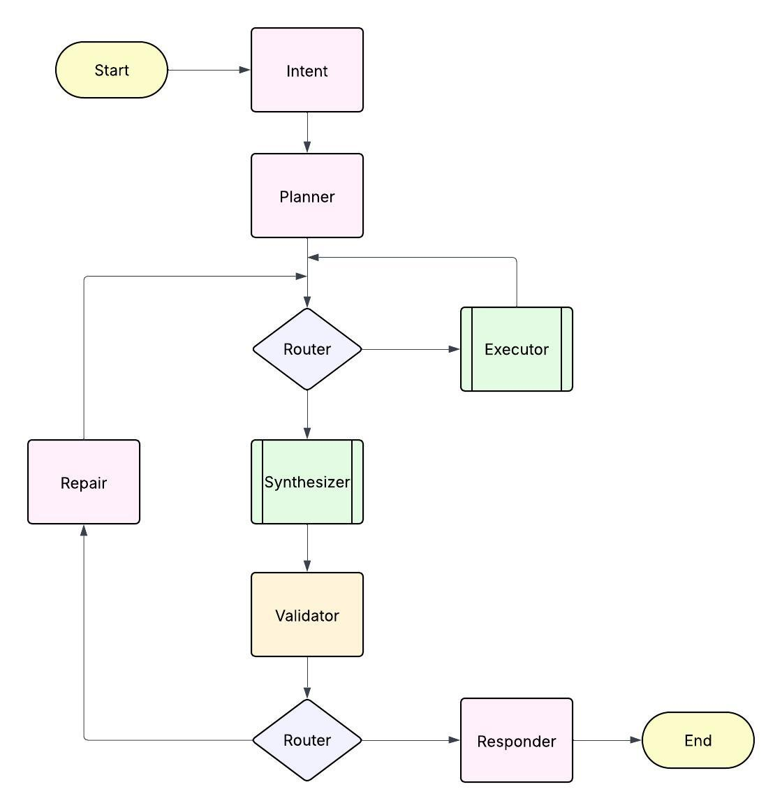

# Atlas Travel Advisor

An Agentic AI Travel Planning Platform that demonstrates modern full-stack development with AI capabilities.

## 🌟 Features

- **AI-Powered Travel Planning**: Intelligent itinerary generation using LangChain and LangGraph
- **Knowledge Base Management**: Vector-based document storage and retrieval
- **Multi-tenant Architecture**: Organization-based user management
- **Real-time Streaming**: WebSocket-based AI agent interactions
- **Modern UI**: Streamlit-based frontend with intuitive navigation
- **Scalable Backend**: FastAPI with PostgreSQL and Redis
- **Containerized Deployment**: Docker Compose for easy setup

## 🏗️ Architecture

### Agent Flow Diagram



The diagram above illustrates the AI agent's decision-making flow, showing how requests move through different processing nodes including Intent analysis, Planning, Execution, Synthesis, Validation, and Response generation.

### Project Structure

```
├── backend/          # FastAPI application
│   ├── app/
│   │   ├── api/      # API routes and dependencies
│   │   ├── core/     # Configuration and security
│   │   ├── models/   # SQLAlchemy database models
│   │   ├── schemas/  # Pydantic validation schemas
│   │   └── services/ # Business logic services
│   └── alembic/      # Database migrations
├── frontend/         # Streamlit application
│   └── pages/        # Multi-page Streamlit app
├── infrastructure/   # Docker and service configuration
│   ├── backend.Dockerfile    # Backend container config
│   ├── frontend.Dockerfile   # Frontend container config
│   ├── Makefile             # CLI automation tools
│   └── atlas.sh             # CLI automation (alternative)
├── tests/            # Test suites
│   ├── unit/         # Unit tests
│   └── integration/  # Integration tests
├── eval/             # AI evaluation scenarios
└── docker-compose.yml # Service orchestration
```

## 🚀 Quick Start

### Prerequisites

- Docker and Docker Compose
- Git

### Running the Application

1. **Clone the repository**
   ```bash
   git clone <repository-url>
   cd atlas-travel-demo
   ```

2. **Start the services (choose one method)**

   **Option A: Using Make (recommended)**
   ```bash
   make start
   ```

   **Option B: Using the Atlas CLI script**
   ```bash
   ./atlas.sh start
   ```

   **Option C: Using Docker Compose directly**
   ```bash
   docker compose up --build
   ```

3. **Access the applications**
   - Frontend (Streamlit): http://localhost:8501
   - Backend API: http://localhost:8000
   - API Documentation: http://localhost:8000/docs

### CLI Shortcuts

The project includes convenient CLI shortcuts for all major operations:

#### Using Make
```bash
make help          # Show all available commands
make start         # Start all services
make stop          # Stop all services
make test          # Run complete test suite
make eval          # Run AI evaluation scenarios
make logs          # Show service logs
make clean         # Clean up containers and volumes
```

#### Using Atlas Script
```bash
./atlas.sh help    # Show all available commands
./atlas.sh start   # Start all services
./atlas.sh stop    # Stop all services
./atlas.sh test    # Run complete test suite
./atlas.sh eval    # Run AI evaluation scenarios
./atlas.sh logs    # Show service logs
./atlas.sh clean   # Clean up containers and volumes
```

Both methods provide the same functionality - choose based on your preference!

### Environment Configuration

Copy `.env.example` to `.env` and configure your environment variables:

```bash
cp .env.example .env
```

Key configuration options:
- Database credentials
- Redis connection
- JWT secret keys
- External API keys (OpenAI, Anthropic)

## 📚 API Documentation

The API provides the following main endpoints:

### Authentication
- `POST /api/v1/auth/login` - User login
- `POST /api/v1/auth/refresh` - Token refresh
- `GET /api/v1/auth/me` - Current user info

### AI Agent
- `POST /api/v1/agent/qa/plan` - Create travel plan
- `WS /api/v1/agent/qa/stream` - Stream agent responses

### Destinations
- `GET /api/v1/destinations` - List destinations
- `POST /api/v1/destinations` - Create destination

### Knowledge Base
- `GET /api/v1/knowledge` - List knowledge items
- `POST /api/v1/knowledge/{id}/ingest-file` - Upload documents

### Operations
- `GET /api/v1/ops/healthz` - Health check
- `GET /api/v1/ops/metrics` - Application metrics

## 🧪 Testing

Run the test suites:

```bash
# Unit tests
docker compose exec backend python -m pytest tests/unit/

# Integration tests
docker compose exec backend python -m pytest tests/integration/

# AI evaluation scenarios
docker compose exec backend python eval/run_scenarios.py
```

## 🛠️ Development

### Backend Development

The backend uses:
- **FastAPI** for the web framework
- **SQLAlchemy** for database ORM
- **Alembic** for database migrations
- **Pydantic** for data validation
- **LangChain/LangGraph** for AI agent orchestration

### Frontend Development

The frontend uses:
- **Streamlit** for the web interface
- **Requests** for API communication
- **Pandas** for data manipulation
- **Plotly** for visualizations

### Database Migrations

Create and apply database migrations:

```bash
# Generate migration
docker compose exec backend alembic revision --autogenerate -m "Description"

# Apply migrations
docker compose exec backend alembic upgrade head
```

## 🔧 Configuration

### Database Setup

The application uses PostgreSQL with the pgvector extension for vector similarity search. The database is automatically initialized with the required extensions.

### Redis Configuration

Redis is used for:
- Session storage
- Caching
- Real-time communication

### AI Integration

Configure your AI provider API keys in the environment variables:
- `OPENAI_API_KEY` for OpenAI models
- `ANTHROPIC_API_KEY` for Anthropic models

## 📊 Monitoring

The application includes built-in monitoring endpoints:
- Health checks at `/api/v1/ops/healthz`
- Metrics at `/api/v1/ops/metrics`

## 🤝 Contributing

1. Fork the repository
2. Create a feature branch
3. Make your changes
4. Add tests for new functionality
5. Submit a pull request

## 📄 License

This project is licensed under the MIT License - see the LICENSE file for details.

## 🆘 Support

For questions and support:
- Check the API documentation at `/docs`
- Review the evaluation scenarios in `eval/`
- Open an issue on GitHub

---

**Note**: This is a demonstration application. For production use, ensure proper security configurations, environment variable management, and monitoring setup.
